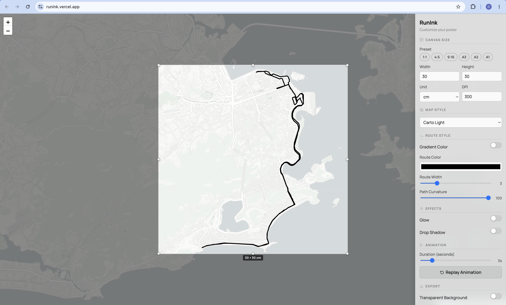

# RunInk

> Transform your GPX runs, rides, and hikes into beautiful print-quality poster art and animated videos.

[**Try Live App at runink.vercel.app**](https://runink.vercel.app/)

RunInk is a client-side web application designed to turn raw GPS track files into customized poster artwork and animated video exports suitable for high-resolution printing.

## Why RunInk

RunInk was born out of a desire to commemorate a first marathon in 2026. A milestone run like that represents months of training, discipline, and persistence, yet in most fitness apps, that memory ends up trapped as a small thumbnail buried in a feed.

RunInk exists for the moment you want that effort to become a tangible object. Something you can frame, hang on your wall, or gift to a training partner. It takes your raw GPS track and turns it into a print-ready poster or short animated video, turning the shape of your run into art.

## Live Web Application

Access and use the application directly in your browser:

**[https://runink.vercel.app/](https://runink.vercel.app/)**

No installation, registration, or server setup required. Simply upload a `.gpx` file to customize and export your poster artwork or MP4 video.

## Features

* **GPX Track Parser**: Effortlessly load `.gpx` files exported from Strava, Garmin Connect, Apple Watch, or Suunto.
* **Custom Poster Dimensions**: Select from standard presets (Instagram 1:1, 4:5, TikTok 9:16, A3, A2, A1) or input custom print dimensions (`cm`, `in`, `px`, `pt`) with configurable resolution up to 600 DPI.
* **Multi-Stop Color Gradients**: Map route colors dynamically by position (Start to End), altitude profile, or calculated pace metrics.
* **Visual Effects**: Apply real-time path curvature smoothing, adjustable glow intensity, and customizable drop shadows.
* **Animation and Replay**: Replay route creation in real time with custom duration controls.
* **High-Resolution Export**:
  * **PNG Posters**: Export print-ready poster artwork with transparent or map-tile backgrounds.
  * **MP4 Video Export**: Generate animated 1080p MP4 videos of your run using client-side `ffmpeg.wasm`.
* **Dark and Light Themes**: Map tile styles automatically adjust base aesthetics and UI themes.

## Built With

* **[Vite](https://vitejs.dev/)**: Fast frontend build tooling and dev server
* **[Leaflet](https://leafletjs.com/)**: Interactive map rendering
* **[Turf.js](https://turfjs.org/)**: Geospatial analysis and line simplification
* **[toGeoJSON](https://github.com/mapbox/togeojson)**: Parsing GPX XML formats to GeoJSON
* **[html2canvas](https://html2canvas.hertzen.com/)**: Canvas capturing for tile export
* **[@ffmpeg/ffmpeg](https://ffmpegwasm.netlify.app/)**: Client-side WebM to MP4 video conversion
* **[Vercel Analytics](https://vercel.com/analytics)**: Privacy-friendly web traffic analytics

## Supported Input Formats

* Standard `.gpx` tracks containing `<trk>` and `<trkpt>` trackpoints with optional elevation `<ele>` and timestamps `<time>`.

## License

This project is licensed under the [MIT License](LICENSE).
